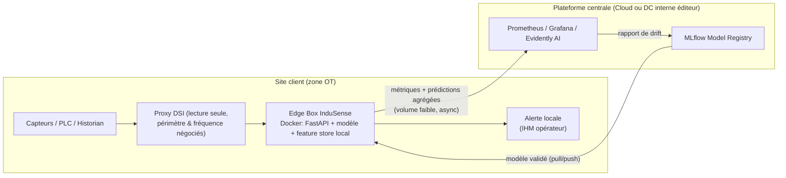

# Architecture de déploiement — InduSense 4.0

> Hypothèse de travail (posée par le formateur) : pas de blocage sécurité, accès aux données de télémétrie garanti et conforme. Le sujet ici est **architecture, modalités de déploiement, coûts, RACI** — pas la négociation d'accès.

## 1. Cadrage : comment on déploie

**Objectif** : passer d'un modèle validé en labo (MLflow) à une solution qui prédit les pannes en conditions réelles, sur le site du client, avec un minimum de points de friction (réseau OT/IT, dépendance à une équipe DSI, couplage fort entre le modèle et l'infra du client).

**Principe directeur de l'architecture** : découpler ce qui doit rester **local** (données brutes, temps réel, OT) de ce qui peut être **centralisé** (registre de modèles, supervision, ré-entraînement). Moins on fait transiter de données brutes hors du site, moins il y a de friction avec la DSI et la sécurité.



Ce que ça élimine comme friction :
- pas de flux continu de données brutes capteurs vers l'extérieur → moins de négociation sécurité/volumétrie ;
- la prédiction reste disponible même si le lien site↔central tombe (l'edge fonctionne en local) ;
- un seul point d'intégration avec la DSI (le proxy en lecture seule), au périmètre et à la fréquence figés dans le DAT.

## 2. Scénarios de déploiement — comparatif

| # | Solution | Avantages | Inconvénients | Coût indicatif* |
|---|---|---|---|---|
| **1 — Recommandé** | **Edge on-site + supervision centrale (hybride)** : petit boîtier/serveur léger sur site (Docker, FastAPI, modèle embarqué), résultats + drift remontés au central | Faible volume de données sortantes → friction sécurité minimale ; fonctionne même en cas de coupure réseau ; scalable (même image Docker déployée par site) ; MCO centralisé (un seul registre de modèles) | Nécessite un poste matériel par site (même léger) ; supervision multi-site à outiller dès le départ | Fourchette basse : ~8-12 k€/site (setup) + ~1,5-2,5 k€/mois (run) <br> Fourchette haute : ~15-20 k€/site + ~3-4 k€/mois |
| **2 — Cloud / SaaS centralisé** | Toute la télémétrie transite vers un cloud central via le proxy DSI ; inférence centrale | Simple à faire évoluer (un seul environnement) ; pas de matériel sur site | Flux continu de données brutes hors site → forte friction sécurité/DSI ; dépendance totale au réseau (latence, coupures) ; coût réseau/stockage qui croît avec le nombre de sites | Setup plus faible par site (~3-5 k€) mais run plus élevé et moins prévisible (bande passante, egress, stockage) |
| **3 — Serveur dédié 100% on-premise (SRV apporté)** | Serveur physique posé chez le client, aucune donnée ne sort | Sécurité maximale pour la DSI cliente ; réponse à des exigences de souveraineté fortes | Un serveur à maintenir par site (matériel, OS, mises à jour) ; RACI compliqué (qui est responsable du matériel physique en cas de panne ?) ; ne passe pas à l'échelle facilement sur N sites | Coût matériel + astreinte plus élevé par site (~15-25 k€ setup, run élevé car pas de mutualisation) |

*Coûts à fourchette large et à valider avec le client — l'écart estimation/réel est systématique sur ce type de déploiement (cf. §5).

**Recommandation** : scénario 1, sauf exigence contractuelle de souveraineté totale des données (auquel cas scénario 3), ou client déjà 100% cloud-native avec DSI cloud mature (scénario 2 devient défendable).

## 3. Déploiement progressif — coûts par tranche

Pas de mise en production big-bang. Approche par paliers, chaque palier validant le suivant :

| Tranche | Périmètre | Durée | Objectif | Coût (ordre de grandeur) |
|---|---|---|---|---|
| **T1 — Pilote / probatoire** | 5 machines identifiées à risque (celles qui lèvent le plus d'alertes historiques) | 3 mois | Valider en conditions réelles : les pannes détectées sont-elles pertinentes métier ? faux positifs acceptables ? | Setup infra (edge) + 0,5 ETP suivi déploiement ≈ **10-15 k€** |
| **T2 — Généralisation site 1** | Reste des machines du site pilote | 2-3 mois | Passage à l'échelle sur un site déjà maîtrisé, ajustement du modèle avec les retours T1 | Marginal par machine supplémentaire (mutualisation edge) ≈ **+3-6 k€** |
| **T3 — Scale multi-site** | Réplication sur N sites | Variable | Industrialiser le déploiement (image Docker standard, CI/CD, RACI multi-site) | Coût par site ≈ coût T1 réduit (courbe d'expérience) — mais cas le plus défavorable = sites "côte à côte" isolés (pas de mutualisation réseau/infra) → à chiffrer site par site |

Chaque tranche mobilise une ressource dédiée au suivi (côté éditeur) **et** côté client (intégration, coordination des équipes internes) — à budgétiser des deux côtés, souvent oublié côté client.

## 4. Coût de fonctionnement (run) — ce que coûte un arrêt machine

Ne pas se limiter au coût brut de l'arrêt. Décomposition :

```
Coût total d'un incident =
    coût d'immobilisation brute (perte de production × durée d'arrêt)
  + coût de réparation (main d'œuvre + pièces, cf. abaques Métier par type de panne)
  + coût de redémarrage (temps de remise en régime nominal après incident,
    souvent sous-estimé : une machine qui redémarre ne reproduit pas
    immédiatement au rythme nominal)
  + coût des opérateurs non productifs pendant l'arrêt + le redémarrage
  + (optionnel) pénalités contractuelles de retard côté client final
```

Exemple donné en référence : **9 k€ pour un arrêt de 6h** — ce chiffre doit être fourni/validé par le Métier (finance, exploitation), pas estimé par l'équipe IA. Il sert de base au calcul du ROI (gain = nombre de pannes évitées × coût unitaire − coût de la solution).

Côté fonctionnement de la solution elle-même (à ajouter aux coûts d'exploitation) :
- infra edge (hébergement, licences OS/Docker) ;
- supervision centrale (Prometheus/Grafana/Evidently, MLflow) ;
- astreinte/support en cas d'alerte critique ;
- ré-entraînement périodique du modèle (déclenché par le drift).

## 5. RACI (synthèse, à décliner par tranche)

| Activité | Éditeur IA | DSI client | Métier client | Direction projet |
|---|---|---|---|---|
| Mise à disposition des données (proxy) | C | **R/A** | I | C |
| Infra edge (setup, run) | **R/A** | C | I | I |
| Modèle (entraînement, ré-entraînement) | **R/A** | I | C | I |
| Validation métier des alertes | C | I | **R/A** | C |
| Décision Go/No-Go par tranche | C | C | C | **R/A** |
| Astreinte incident critique | **R** | C | I | **A** |

*(R = Responsible, A = Accountable, C = Consulted, I = Informed)*

## 6. Autres points à ne pas oublier

- **Latence / criticité** : viser un temps de réponse "acceptable" (pas la performance à outrance) — dépend de la criticité métier de l'alerte, pas d'un objectif technique dans l'absolu.
- **Tests de charge** : nécessaires si l'API sert plusieurs sites/utilisateurs simultanément (vélocité du système, pas seulement du modèle).
- **Plan de rollback** : que fait-on si le modèle déployé en T2/T3 dérive ou sous-performe par rapport au pilote ? Revenir à quelle version ?
- **Gouvernance du modèle** : qui décide/valide un ré-entraînement en production (cf. MLflow Model Registry, promotion staging → prod) ?
- **Empreinte carbone** du run (CodeCarbon) à intégrer dans le coût de fonctionnement, pas seulement dans la phase labo.
- **Écart estimation/réel** : toujours présenter une fourchette basse/haute, jamais un chiffre unique, sur les coûts comme sur les délais.
- **Contractuel** : le ROI promis engage juridiquement — cadrer les hypothèses de calcul (nombre de pannes évitées attendu, période de mesure) avant signature.
