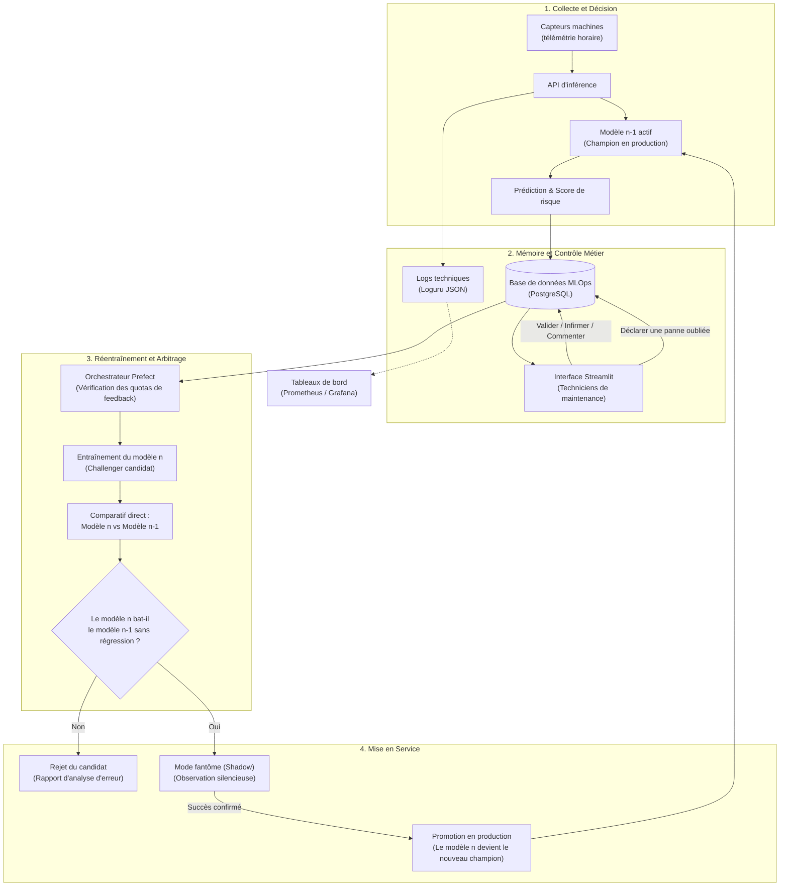

# Feuille de route MLOps — InduSense

> **Objectif :** Transformer les prédictions d'un modèle d'intelligence artificielle déjà en production en un système industriel fiable, capable d'apprendre des retours du terrain, de se réentraîner sans risque et de prouver concrètement qu'une nouvelle version est meilleure que la précédente.

---

## 1. Comprendre le problème : pourquoi un modèle ne progresse-t-il pas seul ?

### La situation de départ
Le système d'InduSense est déjà opérationnel :
- Toutes les heures, une API reçoit les relevés de capteurs de chaque machine (vibrations, température, pression, etc.).
- Un premier modèle d'apprentissage automatique (modèle $n-1$, dit le **champion**) calcule le risque de panne.
- L'infrastructure technique est surveillée par Prometheus et Grafana, et les flux automatisés sont orchestrés avec Prefect.

### Ce qu'il manque pour fermer la boucle
Dans l'industrie, une prédiction mathématique n'est qu'une hypothèse. Tant qu'un technicien n'est pas intervenu sur la machine, l'ordinateur ignore s'il avait raison ou tort.

Sans retour terrain organisé :
1. **L'algorithme tourne en boucle ouverte** : il répète les mêmes erreurs sans jamais apprendre.
2. **Le système perd la confiance des équipes** : si les alertes sont trop souvent fausses, les opérateurs finissent par couper les notifications.
3. **Le réentraînement devient dangereux** : réentraîner un modèle sur des données non vérifiées peut dégrader ses performances sans qu'on s'en aperçoive.

### L'objectif visé : la boucle avec humain dans la boucle (HITL)
Nous mettons en place un cercle vertueux en quatre temps :
- **Archiver :** Enregistrer chaque décision prise par le modèle $n-1$ avec les mesures exactes qui l'ont déclenchée.
- **Valider :** Offrir aux équipes de maintenance une interface web simple (Streamlit) pour certifier si l'alerte était justifiée ou erronée.
- **Comparer :** Mesurer précisément si le nouveau modèle candidat (modèle $n$) fait mieux que l'ancien ($n-1$) sur les mêmes situations réelles.
- **Déployer sans risque :** Ne remplacer le modèle en place que s'il prouve une réelle valeur ajoutée sans créer de régressions inacceptables.

---

## 2. Le schéma d'ensemble : comment circule l'information

Voici la carte générale de l'architecture. Elle illustre comment la donnée technique des capteurs se transforme en décision humaine, puis en nouveau modèle validé :



---

## 3. Étape 1 — Conserver la trace de chaque prédiction

Pour juger plus tard si une décision était bonne, il est obligatoire d'enregistrer l'état exact des données au moment où la machine a été évaluée.

### Ce qu'il faut enregistrer en base
Chaque ligne d'inférence doit stocker :
- **L'identité de l'événement :** numéro de série de la machine, date et heure précises (en UTC).
- **Le modèle auteur :** son nom et son numéro de version exact (ex. `v1.2.0`).
- **La photo des données d'entrée :** les valeurs numériques des capteurs au moment du calcul (vibrations, température, etc.).
- **Le verdict de l'algorithme :** prédiction binaire (0 = normal, 1 = alerte), score de probabilité (ex. 84 %) et seuil appliqué.
- **La performance technique :** temps de réponse en millisecondes pour surveiller la santé de l'API.
- **La case pour le retour métier :** laissée vide au départ, prête à être complétée par l'humain.

### Quel outil Python choisir ?
- **`loguru` pour les fichiers de diagnostic :** Il génère des fichiers texte structurés au format JSON. Ces logs servent aux informaticiens à comprendre un plantage ou un ralentissement survenu à 3 heures du matin.
- **PostgreSQL avec `SQLAlchemy` pour la base métier :** Une base de données relationnelle est indispensable. Elle permet de modifier une ligne quand l'opérateur valide l'alerte, de poser des verrous pour éviter les collisions et de filtrer rapidement les données pour le réentraînement.

> **Pourquoi pas un fichier CSV ?**  
> Les fichiers CSV sont très bien pour exporter un échantillon dans Excel, mais ils ne gèrent pas les écritures simultanées. Si deux requêtes écrivent en même temps sur un CSV, le fichier se corrompt.

#### Exemple de structure de table (SQLAlchemy)
```python
from datetime import datetime, timezone
from uuid import uuid4
from sqlalchemy import Boolean, DateTime, Float, Integer, String
from sqlalchemy.dialects.postgresql import JSONB
from sqlalchemy.orm import DeclarativeBase, Mapped, mapped_column

class Base(DeclarativeBase):
    pass

class PredictionLog(Base):
    __tablename__ = "prediction_logs"

    # Identifiants uniques
    prediction_id: Mapped[str] = mapped_column(String(36), primary_key=True, default=lambda: str(uuid4()))
    machine_id: Mapped[str] = mapped_column(String(100), index=True)
    event_timestamp: Mapped[datetime] = mapped_column(DateTime(timezone=True), index=True)
    
    # Version du modèle ayant pris la décision
    model_version: Mapped[str] = mapped_column(String(50), index=True)
    
    # Photographie exacte des capteurs (format JSON)
    features_payload: Mapped[dict] = mapped_column(JSONB)
    
    # Verdict du modèle n-1
    prediction: Mapped[int] = mapped_column(Integer)
    probability: Mapped[float] = mapped_column(Float)
    
    # Feedback terrain (complété ultérieurement par l'opérateur)
    review_status: Mapped[str] = mapped_column(String(30), default="A_VALIDER", index=True)
    ground_truth: Mapped[bool | None] = mapped_column(Boolean, nullable=True) # Vrai (panne) ou Faux
    reviewer_comment: Mapped[str | None] = mapped_column(String(500), nullable=True)
    reviewed_at: Mapped[datetime | None] = mapped_column(DateTime(timezone=True), nullable=True)
```

---

## 4. Étape 2 — L'interface de validation Streamlit pour les équipes terrain

Le technicien de maintenance ne doit pas manipuler de code ni de requêtes SQL. L'application Streamlit lui présente les prédictions sous une forme visuelle, compréhensible et facile à qualifier.

### Le vocabulaire métier
Une simple case « Vrai / Faux » est insuffisante dans une usine. L'interface propose des choix conformes au quotidien de l'atelier :
- **Panne confirmée :** Le composant était bien endommagé ou sur le point de rompre.
- **Fausse alerte :** La machine fonctionnait parfaitement, l'alerte n'avait pas lieu d'être.
- **Maintenance préventive :** La pièce a été changée selon le planning habituel, empêchant de savoir si elle aurait cassé.
- **Capteur défaillant :** Ce n'est pas le moteur qui surchauffe, c'est la sonde de température qui est débranchée ou sale.
- **Déclarer un incident non prédit :** Le modèle n'a rien vu venir, mais la machine s'est arrêtée net (ce cas est le plus précieux pour progresser !).

### Exemple d'interface intuitive en Streamlit
```python
import streamlit as st
import pandas as pd
from datetime import datetime, timezone

st.set_page_config(page_title="InduSense - Revue Terrain", layout="wide")
st.title("🛠️ Validation des alertes machines")

# Exemple : alerte remontée par le modèle n-1
st.subheader("Machine : Presse-Hydraulique-04")
col1, col2, col3 = st.columns(3)
col1.metric("Probabilité d'incident", "87 %", delta="Critique", delta_color="inverse")
col2.metric("Température relevée", "92 °C", delta="+14 °C au-dessus de la normale")
col3.metric("Niveau de vibration RMS", "4.8 mm/s")

st.info("Le modèle soupçonne une dégradation du roulement principal.")

# Formulaire d'action pour le technicien
choix = st.radio(
    "Constat réel sur le terrain :",
    ["Panne réelle constatée", "Fausse alerte (machine saine)", "Capteur endommagé", "Maintenance préventive effectuée"]
)

commentaire = st.text_input("Commentaire ou numéro de bon d'intervention :")

if st.button("Enregistrer la qualification", type="primary"):
    # Mise à jour en base de données de la ligne correspondante
    st.success("Merci ! Votre retour est enregistré et servira à améliorer le modèle.")
```

---

## 5. Étape 3 — Comparer le nouveau modèle ($n$) à l'ancien ($n-1$) sur le réel

Cette étape répond à la question centrale : **comment être sûr que le modèle $n$ est meilleur que le modèle $n-1$ ?**

### Le principe : le rejeu sur l'historique archivé
Puisque chaque prédiction du modèle $n-1$ est stockée avec sa vérité terrain validée par le technicien, nous disposons d'un examen grandeur nature.

Il suffit de :
1. Reprendre toutes les mesures passées où le technicien a donné son verdict.
2. Soumettre ces mêmes données au nouveau modèle $n$.
3. Comparer directement les résultats des deux modèles face à la réalité observée.

```
                  [ Données archivées en base ]
  Mesures capteurs ──► Modèle n-1 (déjà prédit) ──► Verdict n-1 (ex. Alerte)
                   ──► Modèle n   (à tester)    ──► Verdict n   (ex. Normal)
                                                          ▲
                                    Vérité terrain ───────┘ (Le technicien a dit : Fausse alerte)
```

### La matrice d'arbitrage : gains contre régressions
Il ne faut jamais se contenter d'un pourcentage moyen de réussite. En industrie, une moyenne peut masquer un danger mortel pour la production.

Pour analyser le comportement des deux modèles, on classe chaque situation dans l'un des 4 cas suivants :

| Situation | Ce que disait le modèle $n-1$ | Ce que dit le modèle $n$ | Vérité constatée | Ce qui se passe en pratique |
|---|---|---|---|---|
| **Gain pur** | Faux | **Juste** | Juste | 🟢 **Victoire nette :** Le nouveau modèle corrige une erreur du précédent. |
| **Stabilité** | Juste | Juste | Juste | ⚪ **Continuité :** Les deux modèles ont bien analysé la situation. |
| **Régression** | **Juste** | Faux | Juste | 🔴 **Danger :** Le nouveau modèle se trompe sur un cas que l'ancien gérait très bien ! |
| **Angle mort** | Faux | Faux | Juste | 🟡 **Difficulté persistante :** Aucun des deux modèles ne sait résoudre ce cas. |

### La règle d'or pour autoriser le nouveau modèle
> **Règle métier :**  
> Un nouveau modèle ne doit pas être validé uniquement parce que son score global est supérieur.  
> **Il doit apporter des gains nets sans créer de régression sur les pannes critiques.**  
> Si le modèle $n$ évite 10 fausses alertes mais rate 2 pannes majeures que le modèle $n-1$ détectait toujours, la mise en production est **refusée**.

### Exemple de script d'arbitrage (accessible à tous)
```python
import pandas as pd
import numpy as np

def arbitrer_modele_n_contre_n_moins_1(df_logs, modele_n):
    """
    df_logs contient :
    - 'features' : les entrées capteurs
    - 'pred_n_moins_1' : ce qu'avait prédit l'ancien modèle
    - 'verite_terrain' : ce qui s'est réellement passé (1 = panne, 0 = sain)
    """
    X = pd.json_normalize(df_logs['features'])
    y_true = df_logs['verite_terrain'].to_numpy()
    y_pred_old = df_logs['pred_n_moins_1'].to_numpy()
    
    # Le nouveau modèle rejoue les situations passées
    y_pred_new = modele_n.predict(X)
    
    # Calcul des réussites respectives
    succes_old = (y_pred_old == y_true)
    succes_new = (y_pred_new == y_true)
    
    gains = np.sum((~succes_old) & succes_new)      # Ancien faux, nouveau juste
    regressions = np.sum(succes_old & (~succes_new))# Ancien juste, nouveau faux
    
    print(f"Cas corrigés par le nouveau modèle : +{gains}")
    print(f"Erreurs inédites créées par le nouveau modèle : -{regressions}")
    print(f"Bilan net : {gains - regressions}")
    
    # Critère d'acceptation simplifié
    if regressions == 0 and gains > 0:
        return "ACCEPTATION_DIRECTE"
    elif gains > (regressions * 3) and regressions <= 1:
        return "ACCEPTATION_SOUS_DEROGATION"
    else:
        return "REJET_DU_MODELE_N"
```

### Le piège à expliquer en cours : le « biais de sélection »
Attention à ce biais très formateur à commenter aux étudiants :
- Le technicien ne va généralement inspecter la machine **que lorsque le modèle $n-1$ a levé une alerte**.
- Par conséquent, les logs contiennent beaucoup de vérifications d'alertes, mais très peu de confirmations sur les périodes où le modèle disait « tout va bien ».
- **Conséquence :** Si le modèle $n-1$ est passé à côté d'une panne sans rien dire, elle n'apparaîtra jamais dans les logs... **sauf si le technicien dispose d'un bouton Streamlit pour déclarer un incident manuellement**. C'est pour cela que ce bouton est indispensable.

---

## 6. Étape 4 — Automatiser le réentraînement avec Prefect

Le réentraînement ne doit pas être déclenché bêtement tous les lundis matin. Si aucune panne n'est survenue dans le mois, réentraîner un modèle ne sert à rien et risque même de déséquilibrer ses paramètres.

### Quand déclencher le calcul ?
Prefect vérifie automatiquement quatre feux verts avant de lancer le réentraînement :
1. **Quota de nouveautés :** Au moins 50 nouvelles validations humaines ont été enregistrées.
2. **Équilibre des données :** Il y a au moins 10 vraies pannes avérées parmi les retours récents.
3. **Qualité des données :** Aucun capteur n'a envoyé de valeurs absurdes (ex. température de 9 999 °C).
4. **Dérive constatée (Drift) :** Les données des machines ont changé (ex. arrivée de l'hiver, nouvel outillage).

### Exemple de pipeline Prefect commenté
```python
from prefect import task, flow
import pandas as pd

@task(name="verifier-conditions")
def verifier_conditions_reentrainement(compteur_labels, pannes_confirmees):
    if compteur_labels < 50:
        return False, "Pas assez de retours terrain accumulés (< 50)."
    if pannes_confirmees < 10:
        return False, "Nombre de pannes réelles insuffisant pour apprendre (< 10)."
    return True, "Conditions réunies pour entraîner un candidat."

@task(name="entrainer-challenger")
def entrainer_challenger(dataset):
    # Entraînement du modèle n
    modele_candidat = ...
    return modele_candidat

@flow(name="cycle-mlops-indusense")
def pipeline_reentrainement():
    # 1. Vérifier si l'effort en vaut la peine
    feux_verts, motif = verifier_conditions_reentrainement(62, 14)
    if not feux_verts:
        print(f"Cycle suspendu : {motif}")
        return
    
    # 2. Entraîner le challenger
    candidat = entrainer_challenger(...)
    
    # 3. Lancer la comparaison avec le modèle précédent
    decision = arbitrer_modele_n_contre_n_moins_1(..., candidat)
    print(f"Résultat de l'arbitrage : {decision}")
```

---

## 7. Étape 5 — Déploiement sécurisé : le mode fantôme (*Shadow*)

Même si le modèle $n$ sort victorieux du comparatif théorique, il reste un test ultime avant de lui confier les clés de l'usine : le **mode fantôme**.

```
                           Télémétrie horaire
                                   │
                 ┌─────────────────┴─────────────────┐
                 ▼                                   ▼
        [ Modèle n-1 Champion ]             [ Modèle n Challenger ]
         (Génère les alertes)               (Calcule en silence)
                 │                                   │
                 ▼                                   ▼
        Techniciens alertés                 Enregistré pour audit
```

- Le modèle $n-1$ continue de protéger l'usine et de sonner en cas de danger.
- Le modèle $n$ reçoit les mêmes données au même instant, mais ses alertes restent confidentielles dans la base.
- Au bout de 7 à 14 jours, on confronte ses calculs silencieux avec ce qui s'est réellement produit dans l'atelier.
- Si le comportement en direct confirme les promesses des tests, la bascule s'effectue automatiquement ou sur simple validation humaine.

---

## 8. Résumé des outils recommandés pour le projet

| Mission | Outil recommandé | Rôle simple |
|---|---|---|
| **Journalisation technique** | `loguru` | Écrire des fichiers de logs clairs et rotatifs pour la maintenance informatique. |
| **Mémoire des prédictions** | `PostgreSQL` + `SQLAlchemy` | Conserver les prédictions, les scores et les avis des techniciens. |
| **Interface de validation** | `Streamlit` | Permettre aux techniciens de qualifier facilement les alertes sans coder. |
| **Contrôle des données** | `Pandera` | Vérifier que les mesures capteurs restent dans des plages physiques réelles. |
| **Orchestration des flux** | `Prefect` | Décider intelligemment quand réentraîner et lancer les comparaisons. |
| **Registre des modèles** | `MLflow` | Garder l'historique de fabrication de chaque version de modèle. |
| **Supervision temps réel** | `Prometheus` + `Grafana` | Afficher les jauges d'alertes et la latence sur les écrans de contrôle. |

---

## 9. Les messages clés à retenir pour vos étudiants

1. **Un modèle sans retour terrain est aveugle :** Il ne suffit pas de surveiller la consommation de mémoire du serveur ; la vraie métrique est l'utilité constatée par l'opérateur.
2. **Les logs ne sont pas une base de données :** On journalise pour diagnostiquer des bugs ; on met en base relationnelle pour apprendre et requêter.
3. **Le modèle $n-1$ est un étalon de mesure précieux :** La meilleure façon d'évaluer le modèle $n$ est de lui faire rejouer exactement ce qu'a vécu le modèle $n-1$ en situation réelle.
4. **Attention aux régressions masquées :** Une amélioration statistique globale qui introduit une panne majeure non détectée est inacceptable en milieu industriel.
5. **Le mode fantôme est la ceinture de sécurité du Data Scientist :** Il protège les équipements et bâtit la confiance du métier avant tout basculement officiel.
