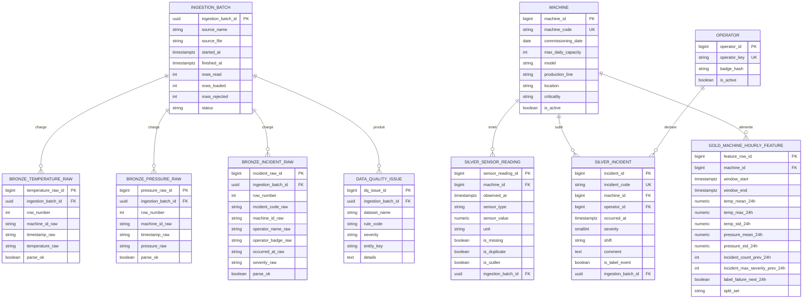

# InduSense

## Modele cible pour l'ingestion PostgreSQL

L'exploration de `datas` met en evidence trois contraintes structurantes pour la suite du projet :
- les trois sources ont des separateurs et des formats heterogenes ;
- les identifiants machine doivent etre normalises avant toute jointure ;
- la fenetre commune exploitable pour le croisement capteurs/incidents est centree sur la periode `2025-08-26` a `2026-02-25`, avec `15` machines communes apres harmonisation.

L'objectif de la prochaine etape n'est donc pas de charger directement les CSV dans une table finale, mais de preparer un modele relationnel qui permette :
- l'atterrissage brut des fichiers ;
- la tracabilite des traitements et des rejets ;
- la construction de tables Silver normalisees ;
- la production d'un Gold dataset horaire, pret pour l'entrainement et protege contre le data leakage.

## Operations a realiser avant l'implementation Alembic / SQLAlchemy

1. Creer une couche `Bronze` qui conserve les lignes brutes, la provenance des fichiers et le statut d'ingestion.
2. Normaliser les `machine_id`, les timestamps et les types de donnees avant de peupler la couche `Silver`.
3. Pseudonymiser les informations operateur des incidents avant de sortir des tables brutes.
4. Isoler les doublons, lignes invalides, timestamps mal formes et valeurs suspectes dans une table de qualite de donnees.
5. Unifier les capteurs temperature et pression dans un fait Silver horodate par machine.
6. Construire un Gold dataset par fenetre temporelle glissante, centre sur `machine x heure`, avec variables explicatives et label cible.
7. Conserver la notion de `split_set` dans le Gold pour verrouiller les futurs jeux `train`, `validation` et `test` temporels.

## Proposition Mermaid

## Lecture proposee du modele

- `Bronze` preserve la verite source, y compris les identifiants heterogenes, les formats d'horodatage et les lignes rejetables.
- `Silver` porte les faits nettoyes et normalises, avec les drapeaux utiles a l'analyse qualite et a l'explicabilite.
- `Gold` represente une table de features temporelles, a granularite stable, adaptee a un apprentissage supervise de prediction de panne.

## Decision de modelisation a retravailler ensemble

- conserver ou non une cle technique `machine_id` en plus de `machine_code` ;
- choisir la granularite cible du Gold : heure, quart d'heure, jour ;
- definir l'horizon du label cible : panne dans `6h`, `12h`, `24h` ou `48h` ;
- fixer les regles exactes de dedoublonnage et de gestion des valeurs manquantes avant le passage en Silver.
